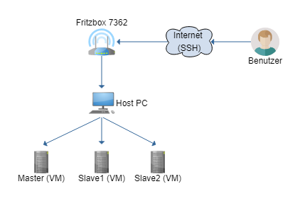

# Big Data

<!-- TOC depthFrom:1 depthTo:6 withLinks:1 updateOnSave:1 orderedList:0 -->

- [Big Data](#big-data)
	- [Aufbau des Clusters](#aufbau-des-clusters)
	- [Hardware](#hardware)
	- [Einrichtung virtueller Maschinen](#einrichtung-virtueller-maschinen)
	- [Netzwerkeinstellungen](#netzwerkeinstellungen)
		- [IPv6 ausschalten](#ipv6-ausschalten)
	- [Installation HDFS](#installation-hdfs)
	- [Konfiguration](#konfiguration)
		- [Single-Node](#single-node)
			- [SSH](#ssh)
			- [etc/hadoop/core-site.xml](#etchadoopcore-sitexml)
			- [etc/hadoop/hdfs-site.xml](#etchadoophdfs-sitexml)
			- [etc/hadoop/hadoop-env.sh](#etchadoophadoop-envsh)
			- [etc/hadoop/mapred-site.xml](#etchadoopmapred-sitexml)
			- [etc/hadoop/yarn-env.sh](#etchadoopyarn-envsh)
			- [etc/hadoop/yarn-site.xml](#etchadoopyarn-sitexml)
			- [Namenode einrichten](#namenode-einrichten)
		- [Cluster](#cluster)
			- [/etc/hosts](#etchosts)
			- [etc/hadoop/core-site.xml](#etchadoopcore-sitexml)
			- [etc/hadoop/hdfs-site.xml](#etchadoophdfs-sitexml)
			- [etc/hadoop/yarn-site.xml](#etchadoopyarn-sitexml)
			- [etc/hadoop/slaves](#etchadoopslaves)
	- [Arbeitsspeicher](#arbeitsspeicher)
		- [etc/hadoop/yarn-site.xml](#etchadoopyarn-sitexml)
		- [etc/hadoop/mapred-site.xml](#etchadoopmapred-sitexml)
	- [Bedienung](#bedienung)
		- [Starten](#starten)
		- [Stoppen](#stoppen)
		- [Prozesse](#prozesse)
	- [HIPI](#hipi)
		- [Installation](#installation)
		- [Updates](#updates)
	- [Gesichter zählen](#gesichter-zählen)
		- [HIPI Abhängigkeit](#hipi-abhängigkeit)
		- [Gradle](#gradle)
			- [build.gradle](#buildgradle)
			- [Erstellen einer JAR-Datei](#erstellen-einer-jar-datei)
		- [FaceCount.java](#facecountjava)
		- [Ausführung auf dem Hadoop Cluster](#ausführung-auf-dem-hadoop-cluster)
	- [Probleme](#probleme)
	- [Quellen](#quellen)

<!-- /TOC -->

## Einleitung
Im Modul Big Data des Masterstudiengangs Informatik WS 2018/2019 an der Hochschule Stralsund wurde ein Hadoop Cluster eingerichtet. Diese Anletung beschreibt die Einrichtung des Clusters, sowie die Konfiguration.

## Aufbau des Clusters
Das nachfolgende Bild veranschaulicht den Aufbau des Hadoop Clusters und wie darauf zugegriffen wird.



## Hardware
Das Cluster besteht aus drei Nodes welche in drei eigenen virtuellen Maschinen laufen. Diese teilen sich auf in ein Master Node und zwei Slave Nodes. Das Hostsystem hat folgende Systemeigenschaften:
- Intel i7-7700 4-core 3.60 GHz
- 32 GB DDR4 RAM
- Windows 10 Pro
- Virtualbox 5.2

Die virtuellen Maschinen verfügen über die folgenden Resourcen:
- 1 vCPU
- 4 GB vRAM
- 15 GB Festplatte
- Ubuntu 18.04.1

## Einrichtung virtueller Maschinen
Für die Erstellung eines virtuellen Clusters wurde VirtualBox 5.2 von der Firma Oracle verwendet. Zusätzlich wurden das Erweiterungspaket installiert. Man findet beides unter

> [www.virtualbox.org](http://www.virtualbox.de)

Nachdem VirtualBox installiert wurde, wurde ein Betriebssystem für die virtuellen Maschinen heruntergeladen. Dabei haben wir uns für die aktuelle Version von [Ubuntu 18.04.1](http://releases.ubuntu.com/18.04/) entschieden. Um möglichst wenig Resourcen zu verwenden wurde ein Minimal-Image heruntergeladen und das Betriebssystem über Konsole installiert.

> [Minimal Image Ubuntu 18.04.1](http://archive.ubuntu.com/ubuntu/dists/bionic-updates/main/installer-amd64/current/images/netboot/)

Zuerst wurde eine einzelne VM eingerichtet. Diese wurde wie im Kapitel [Single-Node](#single-node) beschrieben eingerichtet. Die eingerichtete VM ist der Masternode. Nach der Einrichtung wurde die VM zwei Mal geklont, welche dann als Slaves eingerichtet. Das System wurde dann von Single-Node auf Multi-Node wie im Kapitel [Cluster](#cluster) beschrieben konfiguriert.

## Netzwerkeinstellungen
Im Hadoop Cluster verfügen die einzelnen VMs über eigene statische IPs:

Maschine | IP
---------|-----------------
master   | 192.168.178.100
slave1   | 192.168.178.101
slave2   | 192.168.178.102

Die IP Adressen wurden über den Router festgelegt. Dabei wurde eine Fritzbox 7362 SL verwendet.

### IPv6 ausschalten
Um Hadoop nutzen zu können muss IPv6 deaktiviert werden. Dies hat unter Ubuntu 18.04 einen Bug, den man berücksichtigen muss.

1. /etc/sysctl.conf Zeilen zum Ende hinzufügen
```bash
net.ipv6.conf.all.disable_ipv6 = 1
net.ipv6.conf.default.disable_ipv6 = 1
net.ipv6.conf.lo.disable_ipv6 = 1
```

2. Konfiguration neu laden
```bash
sudo sysctl -p
```

3. Bug beheben, dass die Konfiguration nach dem Neustart noch vorhanden ist. Dazu muss die Datei /etc/rc.local erstellt werden, mit folgenden Inhalt:
```bash
 #!/bin/bash
 # /etc/rc.local
 # Load kernel variables from /etc/sysctl.d
/etc/init.d/procps restart
exit 0
```

4. Rechte für Datei nutzen
```bash
sudo chmod 755 /etc/rc.local
```

## Installation HDFS
Das Hadoop Distributed File System (HDFS) ist ein verteiltes Dateisystem, welches auf normalen Rechnern installiert werden kann. Es steht für Anwender frei zur Verfügung.

Viele Teile von Hadoop wurden in Java geschrieben. Aufgrund dessen müssen auf allen Nodes folgende Programme installiert werden. Dabei kann, wie bereits in [Einrichtung virtueller Maschinen](#einrichtung-virtueller-maschinen) beschrieben, das folgende auf dem Master Node angewandt werden und die virtuelle Maschine dann geklont werden.

Zuerst muss das OpenJDK installiert werden. Dabei wurde auf das Default-JDK unter Ubuntu zurückgegriffen, welches das OpenJDK-11 zur Zeit der Einrichtung ist.
```bash
apt install default-jdk
```

Nachdem Java installiert wurde kann Hadoop 2.9.1 heruntergeladen und entpackt werden.
```bash
wget -c  https://archive.apache.org/dist/hadoop/core/hadoop-2.9.1/hadoop-2.9.1.tar.gz
tar -xvf hadoop-2.9.1.tar.gz
```

Das entpackte Paket kann nun in einen Ordner verschoben werden, in dem Hadoop installiert werden soll. Dabei haben wir uns für den Ordner /opt im Linux Dateisystem entschieden, da dieser Ordner für optionale Software verwendet wird.
```bash
sudo mv hadoop /opt/hadoop
```

Auf dem System müssen dann Pfade erstellt und angegeben werden, welche für den NameNode und DataNode benötigt werden. Dies wurde wie folgt erstellt:
```bash
sudo mkdir /opt/hadoop-data
sudo mkdir /opt/hadoop-data/name
sudo mkdir /opt/hadoop-data/data
```

Um Hadoop auch ohne Rootrechten nutzen zu können wurden die Eigentümer für die neuen Ordner auf für den User hadoop auf *hadoop* gesetzt:
```bash
sudo chown -R hadoop:hadoop /opt/hadoop
sudo chown -R hadoop:hadoop /opt/hadoop-data
```

Da der Aufruf von Hadoop über den Pfad sehr umständlich ist wurde zur Vereinfachung die Pfadvariable erweitert um die Pfade zu den ausführbaren Dateien in Hadoop. Diese befinden sich unter ```/opt/hadoop/bin``` und ```/opt/hadoop/sbin```.
```bash
echo "export PATH=$PATH:/opt/hadoop/bin:/opt/hadoop/sbin" >> ~/.bashrc
```

## Konfiguration
In den folgenden Kapiteln wird zuerst die Einrichtung eines einzelnen Nodes beschrieben. Dies wird dann erweitert um weitere Nodes, welche dann ein Cluster bilden.

### Single-Node
Die Einrichtung eines einzelnen Nodes wird auf der Apache Webseite zu Hadoop beschrieben. Wir haben uns bei der Einrichtung an dieser orientiert:  [Apache Hadoop](https://hadoop.apache.org/docs/r2.9.1/hadoop-project-dist/hadoop-common/SingleCluster.html).

#### SSH
Damit die Nodes untereinander kommunizieren können, ist es notwendig einen SSH Schlüssel auf jeden Node zu erstellen. Dieser wird dann auf jeden Node installiert, sodass alle Nodes untereinander mit Hadoop kommunizieren können.
```bash
ssh-keygen -t rsa -P '' -f ~/.ssh/id_rsa
ssh-copy-id 'Name des Ziels'
```

Bei der Einrichtung eines einzelnen Nodes muss das Ziel der Master Node sein: *master*.

#### etc/hadoop/core-site.xml
In der Datei ```core-site.xml``` wird angegeben wo sich die NameNodes im Cluster befinden. Zudem werden Grundfunktionalitäten wie HDFS und MapReduce dort definiert. Hier wird der Zugriffspunkt aus dem Netzwerk definiert. In diesem Fall *localhost:9000*.
```bash
<configuration>
    <property>
        <name>fs.defaultFS</name>
        <value>hdfs://localhost:9000</value>
    </property>
</configuration>
```

#### etc/hadoop/hdfs-site.xml
- Namenode Dateisystem Pfad angeben
- Datanode Dateisystem Pfad angeben
- Replikationen von Blöcken einstellen

```bash
<configuration>
    <property>
        <name>dfs.namenode.name.dir</name>
        <value>file:/opt/hadoop-data/name</value>
    </property>

    <property>
        <name>dfs.datanode.data.dir</name>
        <value>file:/opt/hadoop-data/data</value>
    </property>

    <property>
        <name>dfs.replication</name>
        <value>1</value>
    </property>
</configuration>
```

#### etc/hadoop/hadoop-env.sh
- Java 11 Pfad anpassen

```bash
export JAVA_HOME=/usr/lib/jvm/java-11-openjdk-amd64/
```

#### etc/hadoop/mapred-site.xml
```bash
<configuration>
    <property>
        <name>mapreduce.framework.name</name>
        <value>yarn</value>
    </property>
</configuration>
```

#### etc/hadoop/yarn-env.sh
- Bugfix für JDK 9+
- siehe Bug [JIRA Hadoop](https://issues.apache.org/jira/browse/HADOOP-14978)

```bash
export YARN_RESOURCEMANAGER_OPTS="--add-modules java.activation"
export YARN_NODEMANAGER_OPTS="--add-modules java.activation"
```

#### etc/hadoop/yarn-site.xml
```bash
<configuration>
    <property>
        <name>yarn.nodemanager.aux-services</name>
        <value>mapreduce_shuffle</value>
    </property>
</configuration>
```

#### Namenode einrichten

> Gegebenenfalls muss vor dem Ausführen von ```hdfs namenode -format``` der Hadoop-Data Ordner geleert werden (master und slaves)

- Namenode Dateisystem formatieren
  - ```hdfs namenode -format```
- DFS starten
  - ```start-dfs.sh```
- User Ordner in DFS einrichten
  - ```hdfs dfs -mkdir /user```
  - ```hdfs dfs -mkdir /user/hadoop```
- Input Dateien kopieren
  - ```hdfs dfs -put etc/hadoop input```

### Cluster
Nachdem die Einrichtung eines Single Nodes erfolgreich abgeschlossen wurde, wurde die Maschine zwei Mal geklont. Dementsprechend müssen die Klone angepasst werden. Es müssen eine neue MAC Adresse für die virtuelle Netzwerkkarte, sowie ein neuer Hostname vergeben werden.

#### /etc/hostname
Um den Namen der Maschine zu ändern, kann man entweder das Programm ```hostnamectl``` in der Kommandozeile verwenden, oder man passt die Hostname-Datei an und ändert den Namen. In diesem Fall müssen Die Namen auf ```slave1``` und ```slave2``` geändert werden.

#### /etc/hosts
Die Hosts-Datei beinhaltet die Informationen über verwendeten Routen zu den unterschiedlichen Rechnern im Netzwerk.

```bash
192.168.178.100 master
192.168.178.101 slave1
192.168.178.102 slave2
```

#### etc/hadoop/core-site.xml
```bash
<configuration>
    <property>
        <name>fs.defaultFS</name>
        <value>hdfs://master:9000</value>
    </property>
</configuration>
```

#### etc/hadoop/hdfs-site.xml
- Replikationen auf Anzahl der Slaves erhöhen

```bash
<configuration>
    <property>
        <name>dfs.namenode.name.dir</name>
        <value>file:/opt/hadoop-data/name</value>
    </property>

    <property>
        <name>dfs.datanode.data.dir</name>
        <value>file:/opt/hadoop-data/data</value>
    </property>

    <property>
        <name>dfs.replication</name>
        <value>2</value>
    </property>
</configuration>
```

#### etc/hadoop/yarn-site.xml
- Adressen für Slaves anpassen

```bash
<configuration>
    <property>
        <name>yarn.nodemanager.aux-services</name>
        <value>mapreduce_shuffle</value>
    </property>

    <property>
        <name>yarn.resourcemanager.address</name>
        <value>master:8031</value>
    </property>

    <property>
        <name>yarn.resourcemanager.scheduler.address</name>
        <value>master:8030</value>
    </property>

    <property>
        <name>yarn.resourcemanager.resource-tracker.address</name>
        <value>master:8032</value>
    </property>
</configuration>
```

#### etc/hadoop/slaves
Damit der Hadoop Master Node mit den Slave Nodes kommunizieren kann, müssen die Hostnames der Slaves in der Datei *slaves* hinzugefügt werden:
```bash
slave1
slave2
```

## Arbeitsspeicher
Hadoop verwendet standardmäßig in für die Nodes 8 GB RAM. Da die eingerichteten Nodes jedoch nur über 4 GB vRAM verfügen, muss dies noch konfiguriert werden. Die folgende Tabelle zeigt dabei die eingestellten Werte.

Eigenschaften                        | Wert
-------------------------------------|------
yarn.nodemanager.resource.memory-mb  | 3072
yarn.scheduler.maximum-allocation-mb | 3072
yarn.scheduler.minimum-allocation-mb | 256
yarn.app.mapreduce.am.resource.mb    | 1024
mapreduce.map.memory.mb              | 512
mapreduce.reduce.memory.mb           | 512

### etc/hadoop/yarn-site.xml
```bash
<property>
    <name>yarn.nodemanager.resource.memory-mb</name>
    <value>3072</value>
</property>

<property>
    <name>yarn.scheduler.maximum-allocation-mb</name>
    <value>3072</value>
</property>

<property>
    <name>yarn.scheduler.minimum-allocation-mb</name>
    <value>256</value>
</property>

<property>
    <name>yarn.nodemanager.vmem-check-enabled</name>
    <value>false</value>
</property>
```

### etc/hadoop/mapred-site.xml
```bash
<property>
        <name>yarn.app.mapreduce.am.resource.mb</name>
        <value>1024</value>
</property>

<property>
        <name>mapreduce.map.memory.mb</name>
        <value>512</value>
</property>

<property>
        <name>mapreduce.reduce.memory.mb</name>
        <value>512</value>
</property>
```


## Bedienung

### Starten
- DFS Starten
```bash
start-dfs.sh
```

- YARN Starten
```bash
start-yarn.sh
```

### Stoppen
- YARN Stoppen
```bash
stop-yarn.sh
```

- DFS Stoppen
```bash
stop-dfs.sh
```

### Prozesse
Prozesse anzeigen
```bash
jps
```

Nach dem Start von DFS und YARN sollten die folgenden die folgenden Prozesse auf dem *Master* angezeigt werden:
```bash
NameNode
Jps
ResourceManager
SecondaryNameNode
NodeManager
```

Auf den *Slaves* sollten jeweils die folgenden Prozesse gestartet sein:
```bash
Jps
SecondaryNameNode
DataNode
```

Die Prozesse haben die folgende Bedeutung:
- NameNode

	Der NameNode kontrolliert und verwaltet alle Dateien, die im HDFS abgespeichert sind. Dabei beinhaltet es nur Metadaten von den Dateien. Es läuft nur auf dem Master Node

- jps

	Mit JPS werden die laufenden Prozesse im Hadoop Cluster angezeigt.

- ResourceManager

	Der ResourceManager verteilt die vorhanden Resourcen an die unterschiedlichen Nodes und sorgt damit für eine optimale Auslastung des Clusters.

- SecondaryNameNode

	Der SecondaryNameNode ist ein Hilfsprozess für den NameNode, welcher den Zugang zum HDFS auf den einzelnen Nodes darstellt.

- DataNode

	Die im Cluster vorhanden Daten werden im DataNode gespeichert. In unserer Konfiguration werden die DataNodes nur auf den Slaves ausgeführt.

- NodeManager

	Der NodeManager sorgt auf jedem Node dafür, dass die Auslastung des Nodes erfasst und an den ResourceManager weitergeleitet wird.

## HIPI
HIPI ist eine Bildverarbeitungsbibliothek für Hadoop, welche an der University of Virginia, USA entwickelt wurde. Für die Bildverarbeitung wird MapReduce verwendet. Zudem bietet es die Möglichkeit große Datenmengen zu verwalten und mit OpenCV auszuwerten.

### Installation
Bei der Installation haben wir uns auf [die offizielle Dokumentation](http://hipi.cs.virginia.edu/gettingstarted.html) der Entwickler bezogen.
- Gradle installieren
```bash
sudo apt install gradle
```

- HIPI clonen
```bash
git clone https://github.com/uvagfx/hipi.git
```

- tools/build.gradle anpassen
```bash
jar {
    manifest {
      attributes("Class-Path" : configurations.runtime.collect { it.getAbsolutePath() }.join(' '));
  //    attributes("Class-Path" : configurations.runtime.collect { it.toURI() }.join(' '));
    }
```

- Gradle nutzen
```bash
cd hipi
gradle
```

### Updates
Möchte man HIPI updaten, kann man dies mit Git machen. Jedoch wurden seit über 3 Jahren keine Änderungen am Quellcode durchgeführt.
```bash
git pull origin release
```

## Gesichter zählen
Bei der Erkennung von und dem zählen von Gesichtern haben wir auf Quellcode von der Webseite [Dinesh's Blog](http://dinesh-malav.blogspot.com/2015/05/image-processing-using-opencv-on-hadoop.html) zurückgegriffen. Diesen haben wir so angepasst, dass wir das System zum Erstellen des Projekts von Ant auf Gradle umgestellt haben. Zudem haben wir als Abhängigkeit *OpenCV* durch *Bytedeco* ersetzt, welche eine Java-Schnittstelle

### HIPI Abhängigkeit
Das Projekt benötigt HIPI. Dieses ist nur lokal vorhanden, jedoch nicht in einem offiziellen Gradle oder Maven Repository. Daher müssen die erstellten JAR-Dateien aus dem vorherigen Kapitel verwendet werden.

Diese befinden sich in *hipi/core/build/libs/hipi-2.1.0.jar* und *hipi/release/hipi-2.0.jar*. Beide müssen in das Root-Verzeichnis des FaceCount Projekts kopiert werden.

### Gradle
>Gradle ist ein auf Java basierendes Build-Management-Automatisierungs-Tool, vergleichbar mit Apache Ant und Apache Maven. Gradle nutzt eine auf Groovy basierende domänenspezifische Sprache (DSL) zur Beschreibung der zu bauenden Projekte. Im Gegensatz zu Maven-Projektdefinitionen (pom.xml) sind Gradle-Skripte direkt ausführbarer Code.

>Gradle wurde für Builds von Softwaresystemen entworfen, welche aus einer Vielzahl von Projekten bestehen. Basierend auf der Philosophie „Erwarte das Unerwartete“ wurde versucht, das in Maven etablierte „build-by-convention“-Prinzip (eine Variante von „Konvention vor Konfiguration“) mit der Flexibilität von Ant zusammenzubringen.

https://de.wikipedia.org/wiki/Gradle am 15.12.2018 um 15.45 Uhr

#### build.gradle
Um das Projekt einrichten zu können benötigt man eine build.gradle Datei, welche sich im Root-Verzeichnis des Projekts befinden. Diese beinhaltet alle Abhängigkeiten und Optionen, die zu Bau des Projekts benötigt werden.
```bash
plugins {
    id 'java'
}

group 'org.hoststralsund'
version '1.0-SNAPSHOT'

repositories {
    mavenCentral()
}

dependencies {
    compile group: 'org.apache.hadoop', name: 'hadoop-common', version: '2.9.1'
    compile group: 'org.apache.hadoop', name: 'hadoop-hdfs', version: '2.9.1'
    compile group: 'org.apache.hadoop', name: 'hadoop-mapreduce-client-core', version: '2.9.1'
    compile group: 'org.bytedeco', name: 'javacv-platform', version: '1.4.3'
    compile group: 'org.bytedeco', name: 'javacpp', version: '1.4.3'
    compile group: 'org.bytedeco', name: 'javacpp-presets', version: '1.4.3'
    compile files('hipi-2.0.jar', 'hipi-2.1.0.jar')
}

jar {
    manifest {
        attributes(
                'Class-Path': configurations.compile.collect { it.getName() }.join(' '),
                'Main-Class': 'org.hoststralsund.faces.FaceCount'
        )
    }
    from configurations.compile.collect { entry -> zipTree(entry) }
}
```

#### Erstellen einer JAR-Datei
Man kann eine JAR-Datei mit Gradle erstellen lassen, wenn man einen Abschnitt *jar* in die build.gradle hinzufügt. In unserem Beispiel werden alle Abhängigkeiten für das Projekt mit in die JAR-Datei eingebunden.

Das Projekt kann nun mit dem folgenden Befehl im Root-Verzeichnis gebaut werden:
```bash
gradle jar
```

### FaceCount.java
Die Klasse FaceCount.java umfasst den gesamten Algorithmus, welcher Gesichter erkennt und zählt. Große Teile stammen wie bereits erwähnt von Dinesh's Blog. Anpassungen wurden bei den Imports gemacht, sowie in der Methode *setup*. Dort wurden die nativen OpenCV Bindungen entfernt.

Die Methode *convertFloatImageToOpenCVMat(FloatImage floatImage)* wurde beibehalten, da die in HIPI vorhandene Funktion *OpenCVUtils.convertRasterImageToMat(RasterImage rasterImage)* keine FloatImages verwenden kann.

Imports
```java
import hipi.image.*;
import hipi.imagebundle.mapreduce.ImageBundleInputFormat;

import org.apache.hadoop.conf.Configured;
import org.apache.hadoop.util.Tool;
import org.apache.hadoop.util.ToolRunner;
import org.apache.hadoop.fs.Path;
import org.apache.hadoop.io.IntWritable;
import org.apache.hadoop.io.Text;
import org.apache.hadoop.mapreduce.lib.input.FileInputFormat;
import org.apache.hadoop.mapreduce.lib.output.FileOutputFormat;
import org.apache.hadoop.mapreduce.Job;
import org.apache.hadoop.mapreduce.Mapper;
import org.apache.hadoop.mapreduce.Reducer;

import org.opencv.core.Mat;
import org.opencv.core.MatOfRect;
import org.opencv.objdetect.CascadeClassifier;
import static org.bytedeco.javacpp.opencv_core.CV_8UC3;


import java.io.IOException;
import java.net.URI;
```

Methode setup
```java
public void setup(Context context)
                throws IOException, InterruptedException {
    // Load OpenCV native library
    /*try {
        System.loadLibrary(Core.NATIVE_LIBRARY_NAME);
    } catch (UnsatisfiedLinkError e) {
        System.err.println("Native code library failed to load.\n" + e + Core.NATIVE_LIBRARY_NAME);
        System.exit(1);
    }*/
...
```

### Ausführung auf dem Hadoop Cluster
#### Cluster starten
Das Cluster startet man, indem man zuerst ```start-dfs.sh``` und danach ```start-yarn.sh```. Danach sollten alle Dienste gestartet sein.

#### Erstellen einer HIB Datei im Cluster
Die vorhanden Bilder, welche für die Bildanalyse verwendet werden sollen müssen zu einer .hib Datei zusammengefasst werden. Dies kann man mit HIPI mit dem folgenden Kommando machen:
```/opt/hipi/tools/hibImport.sh ~/images images.hib```

Der Befehl erstellt eine .hib und eine .hib.dat im HDFS-HOME Ordner.

#### Programm starten
Das Programm zur Gesichtserkennung wird mit Hadoop gestartet. Dabei greift es auf das HDFS zu und arbeitet mit dem dort vorhandenen Dateisystem.
```bash
hadoop jar FaceCount.jar images.hib output
```

## Probleme
- Nach der Installation von Hipi haben wir versucht das Beispielprogramm auszuführen. Daraufhin ist ein Fehler aufgetreten, welchen wir bei Stackoverflow beschrieben haben:
> https://stackoverflow.com/questions/53298672/hadoop-hipi-hibimport-noclassdeffounderror/53409716#53409716

- Nach einem Neustart der VMs ist es nicht mehr möglich auf ein bereits vorhandenes HDFS zuzugreifen. Die einzige Möglichkeit, welche das Problem behebt, ist eine Neuformatierung des HDFS, wobei alle enthaltenen Daten verloren gehen. Diese Lösung ist nicht optimal, jedoch wurde keine andere funktionierende Lösung gefunden.

	Das Formatieren wurde durch ein Skipt automatisiert. formatRoutine.sh:

	```bash
	stop-yarn.sh
	stop-dfs.sh

	hdfs namenode -format
	start-dfs.sh
	hdfs dfs -mkdir /user
	hdfs dfs -mkdir /user/hadoop
	```

## Quellen
- https://www.linode.com/docs/databases/hadoop/how-to-install-and-set-up-hadoop-cluster/
- https://hadoop.apache.org/docs/r2.9.1/hadoop-mapreduce-client/hadoop-mapreduce-client-core/MapReduceTutorial.html
- https://hadoop.apache.org/docs/r2.9.1/hadoop-project-dist/hadoop-common/ClusterSetup.html
- https://www.admintome.com/blog/disable-ipv6-on-ubuntu-18-04/
- http://dinesh-malav.blogspot.com/2015/05/image-processing-using-opencv-on-hadoop.html
